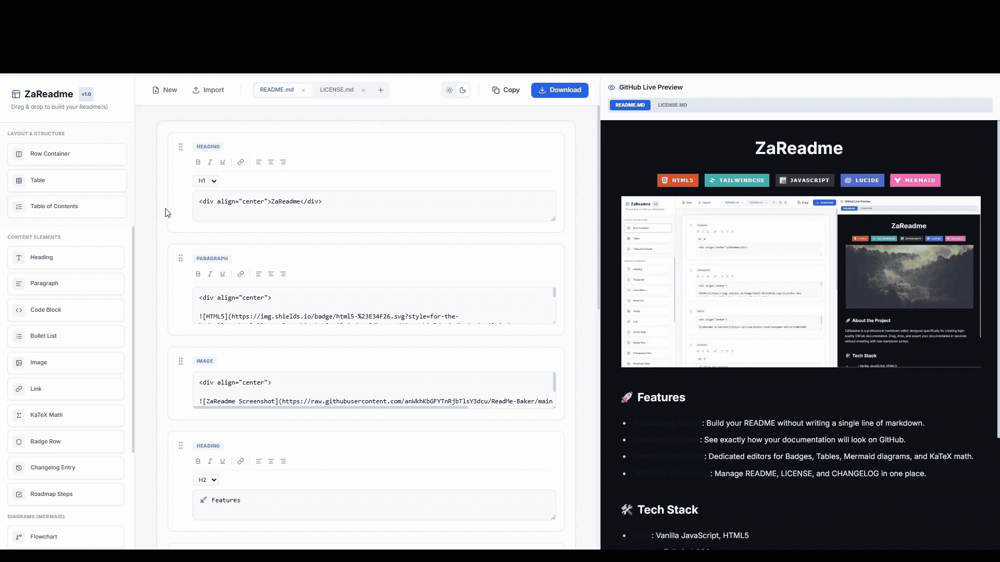
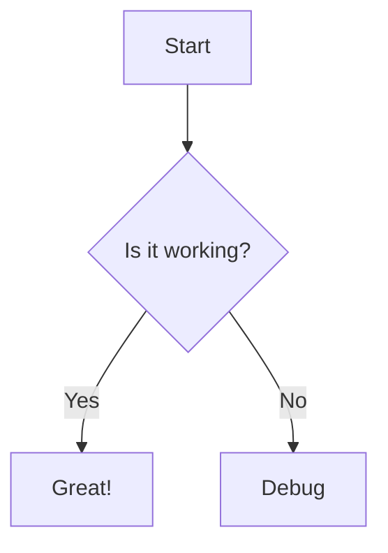
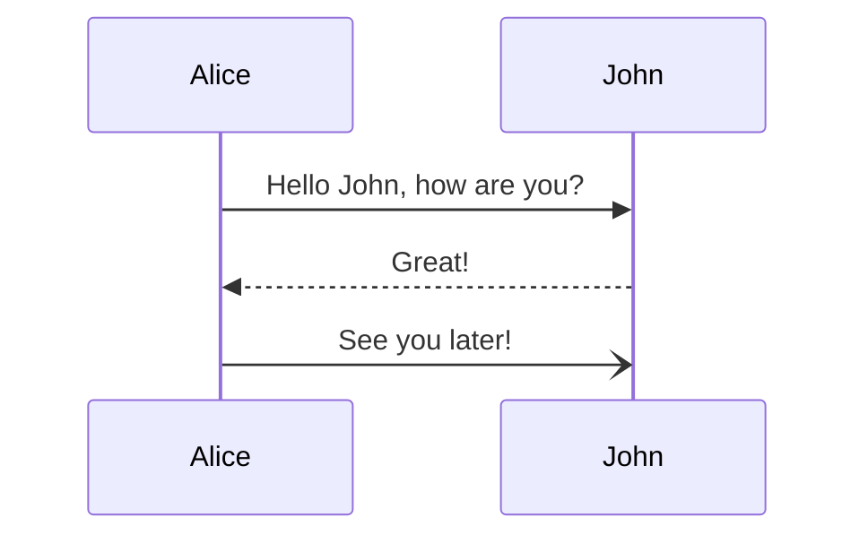
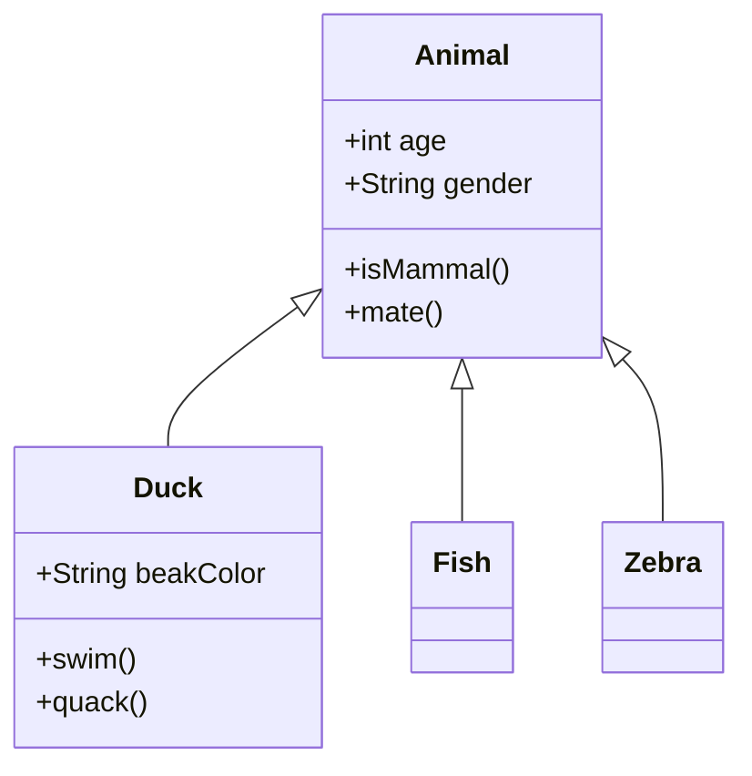
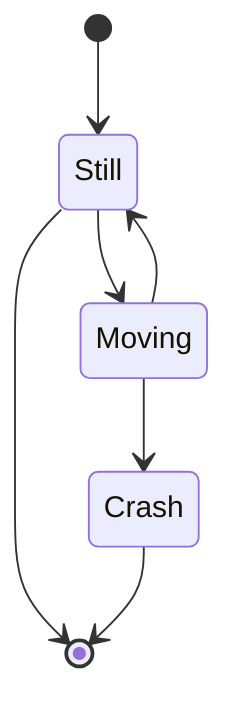
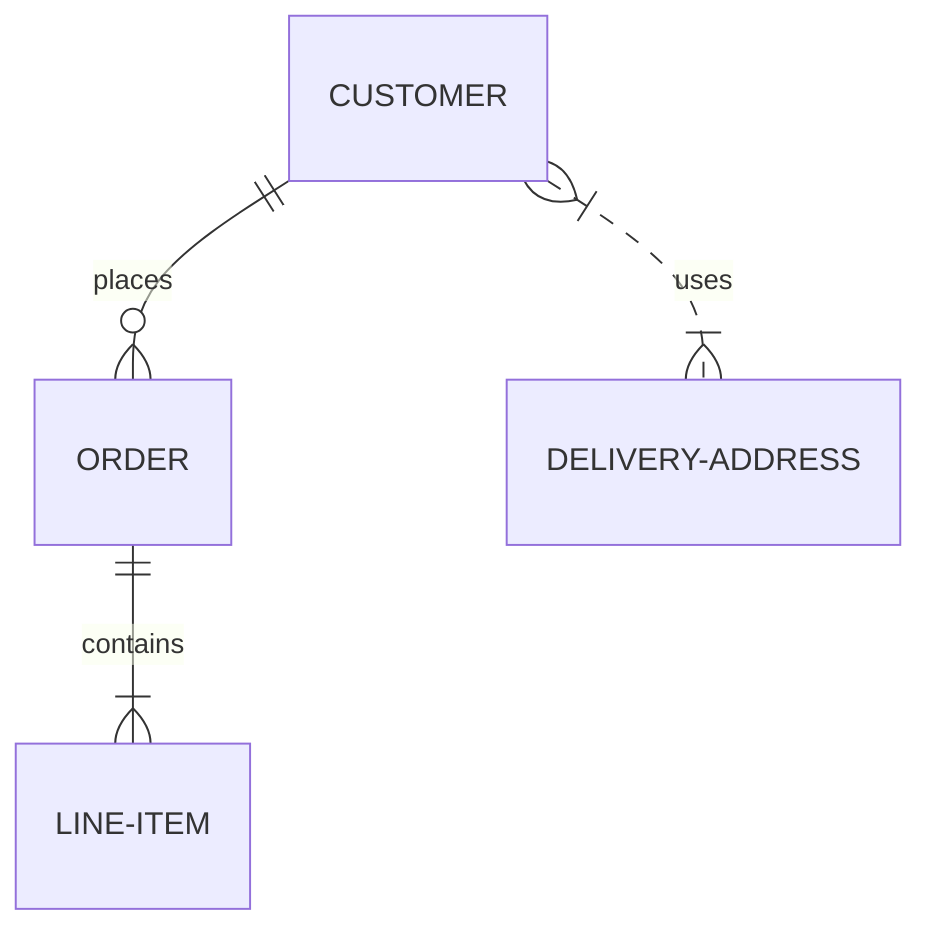
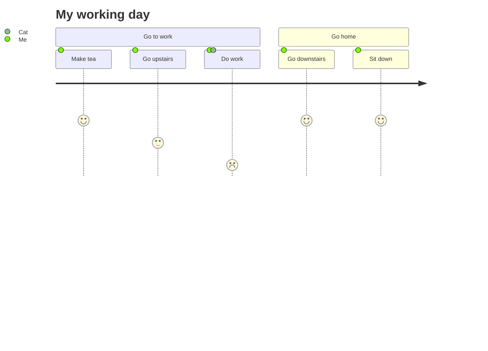

# <div align="center"> 📦 ➔ 📥 Readme Builder</div>

<div align="center">

  
<br>

    

</div>

Finished the project and you want a great Readme file?<br>
Find here the ultimate tool for creating professional, high-quality documentation for your GitHub projects. No more wrestling with raw markdown syntax—just drag, drop, and export.<br>
Check [project wiki](../../wiki) for more details! Or scroll.




---

# Features and Examples

- [Features and Examples](#features-and-examples)
  - [Table](#table)
  - [Math](#math)
  - [Badges](#badges)
  - [Changelog](#changelog)
  - [Steps/ToDos](#steps-todos)
  - [Diagrams: FlowCharts](#diagrams-flowcharts)
  - [Diagrams: Sequence](#diagrams-sequence)
  - [Diagrams: Class (OOP)](#diagrams-class-oop-)
  - [Diagrams: State Diagram](#diagrams-state-diagram)
  - [Diagrams: Steps](#diagrams-steps)
  - [User Journey](#user-journey)
  - [Import/Export from Readme](#import-export-from-readme)
  - [Code blocks, paragrapsh, bullet list, images, link](#code-blocks-paragrapsh-bullet-list-images-link)

## Table

| Header 1 | Header 2 |
| -------- | -------- |
| Cell 1   | Cell 2   |

## Math

$$ e = mc^2 $$
$$ y^2 + y^2 = 2y^2 $$

## Badges

<div align="center">

     

</div>

## Changelog

### [1.0.0] - 2023-10-27

#### Added

- New feature A
- New feature B

#### Fixed

- Bug fix C

## Roadmap

- [x] Add Changelog
- [x] Add back to top links
- [ ] Add Additional Templates w/ Examples
- [ ] Add "components" document to easily copy & paste sections of the readme
- [ ] Multi-language Support
    - [ ] Chinese
    - [ ] Spanish

## Diagrams: FlowCharts



## Diagrams: Sequence



## Diagrams: Class (OOP)



## Diagrams: State Diagram



## Diagrams: Steps



## User Journey



## Import/Export from Readme


## Code blocks, paragrapsh, bullet list, images, link

```javascript
console.log("Hello World");
```

[Visit Website](https://example.com)

- Item 1
- Item 2
- Item 3