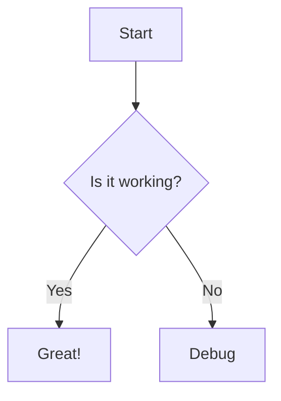
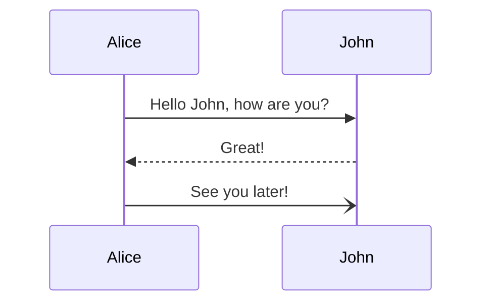
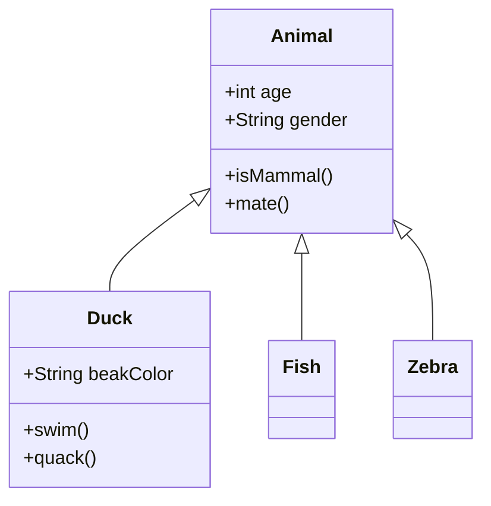
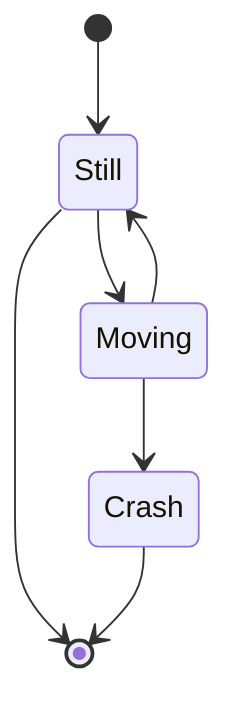
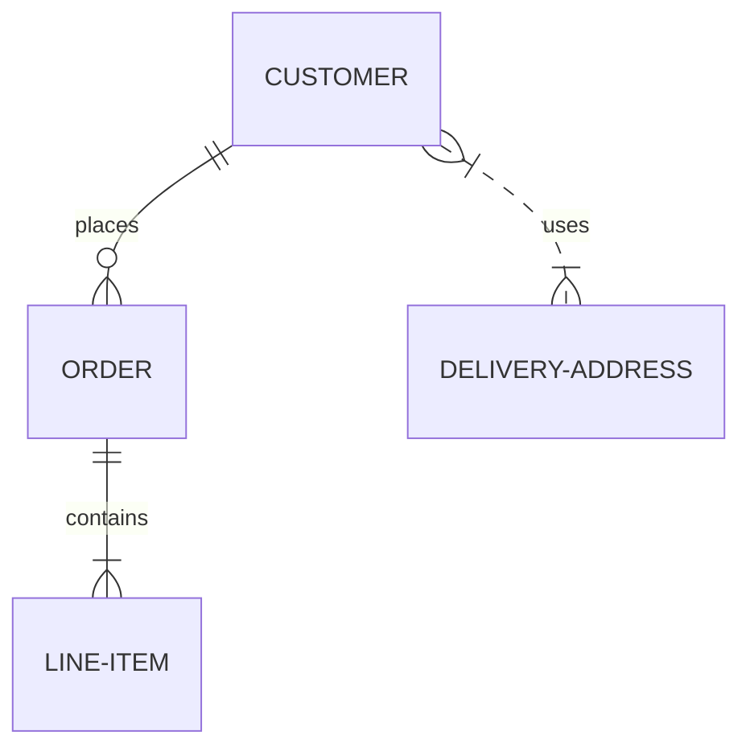
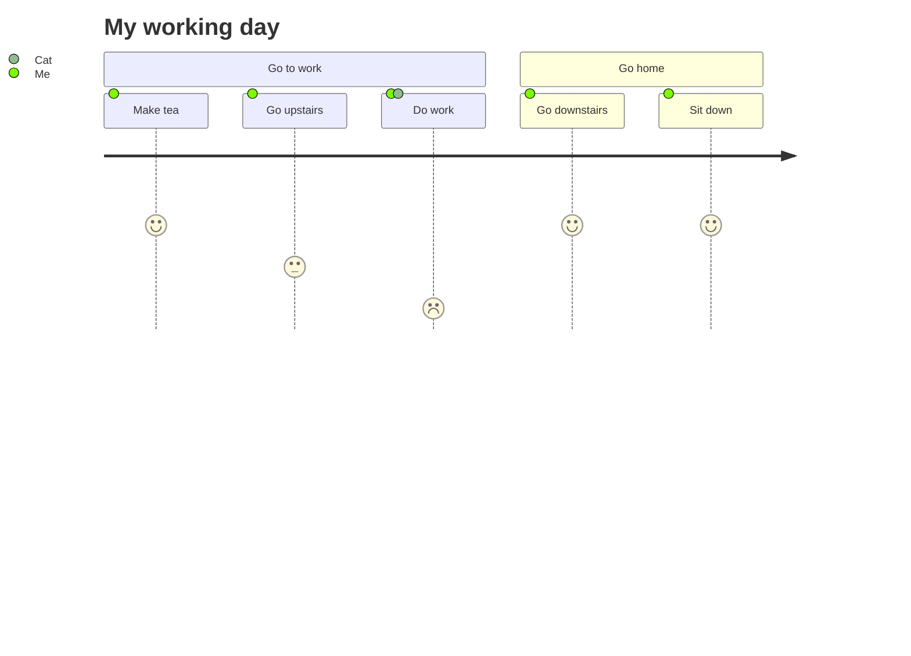

# <div align="center"> 📦 ➔ 📥 Readme Builder</div>

<div align="center">

  
<br>

    

</div>

Finished the project and you want a great Readme file?<br>
Find here the ultimate tool for creating professional, high-quality documentation for your GitHub projects. No more wrestling with raw markdown syntax—just drag, drop, and export.<br>
Check [project wiki](../../wiki) for more details! Or scroll.


---

## 🤝 Contributing

We welcome contributions to this project. Please follow these steps to contribute:

1. **Fork the repository.**
2. **Create a new branch** (`git checkout -b feature/your-feature-name`).
3. **Make your changes** and commit them (`git commit -m 'Add some feature'`).
4. **Push to the branch** (`git push origin feature/your-feature-name`).
5. **Open a pull request**.

Please make sure to update tests as appropriate.

## 🐛 Issues

If you encounter any issues while using or setting up the project, please check the [Issues]() section to see if it has already been reported. If not, feel free to open a new issue detailing the problem.

When reporting an issue, please include:

- A clear and descriptive title.
- A detailed description of the problem.
- Steps to reproduce the issue.
- Any relevant logs or screenshots.
- The environment in which the issue occurs (OS, browser, Node.js version, etc.).

## 🛠️ Tech Stack

| Layer | Technology |
| :--- | :--- |
| Core | Vanilla JavaScript, HTML5 |
| Styling | Tailwind CSS + Typography plugin |
| Icons | Lucide Icons |
| Markdown | Marked.js + GFM Heading IDs |
| Diagrams | Mermaid.js (Flowchart, Sequence, Class, State, ER, Journey) |
| Math | KaTeX |
| Drag & Drop | SortableJS |
| Export | JSZip |
| Build (dev) | Vite + TypeScript |

## 📦 Installation

### Option A — Just open it (no install needed)
The app is a single self-contained HTML file. Download `index.html` and open it in any browser.

### Option B — Run locally without CDN/update something in TS
```
# 1. Clone the repository
git clone https://github.com/your-username/zareadme.git
cd zareadme

# 2. Install dependencies
npm install

# 3. Start the dev server
npm run dev
```

Then open [http://localhost:3000](http://localhost:3000) in your browser.

### Build for production
```
npm run build
```
Output is in the `dist/` folder.

---

# Features and Examples

- [Features and Examples](#features-and-examples)
  - [Import/Export from Readme](#import-export-from-readme)
  - [Table](#table)
  - [Math](#math)
  - [Badges](#badges)
  - [Changelog](#changelog)
  - [Steps/ToDos](#steps-todos)
  - [Diagrams: FlowCharts](#diagrams-flowcharts)
  - [Diagrams: Sequence](#diagrams-sequence)
  - [Diagrams: Class (OOP)](#diagrams-class-oop-)
  - [Diagrams: State Diagram](#diagrams-state-diagram)
  - [Diagrams: Entity relationship](#diagrams-steps)
  - [User Journey](#user-journey)
  - [Code blocks, paragrapsh, bullet list, images, link](#code-blocks-paragrapsh-bullet-list-images-link)

## Import/Export from Readme


## Table

| Header 1 | Header 2 |
| -------- | -------- |
| Cell 1   | Cell 2   |

## Math

$$ e = mc^2 $$
$$ y^2 + y^2 = 2y^2 $$

## Badges

<div align="center">

     

</div>

## Changelog

### [1.0.0] - 2023-10-27

#### Added

- New feature A
- New feature B

#### Fixed

- Bug fix C

## Roadmap

- [x] Add Changelog
- [x] Add back to top links
- [ ] Add Additional Templates w/ Examples
- [ ] Add "components" document to easily copy & paste sections of the readme
- [ ] Multi-language Support
    - [ ] Chinese
    - [ ] Spanish

## Diagrams: FlowCharts



## Diagrams: Sequence



## Diagrams: Class (OOP)



## Diagrams: State Diagram



## Diagrams: Steps



## User Journey



## Code blocks, paragrapsh, bullet list, images, link

```javascript
console.log("Hello World");
```

[Visit Website](https://example.com)

- Item 1
- Item 2
- Item 3